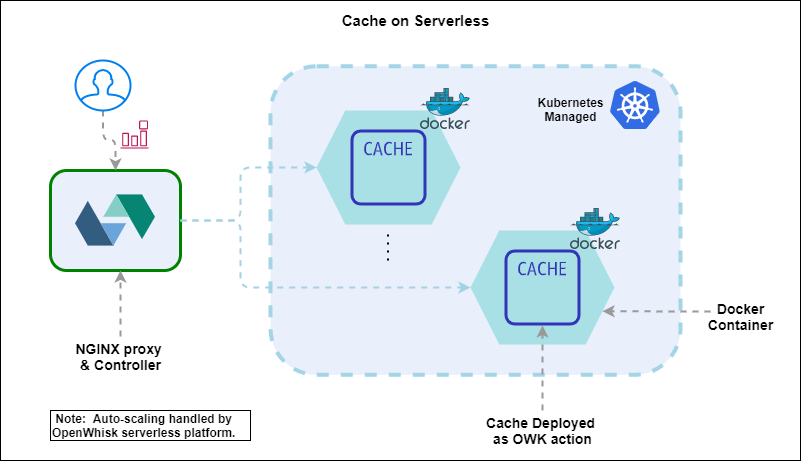

# Auto-Scaling Cache for Serverless

> Team Members: Shubham Shingate, Nirja Shah

> Technologies Used: Java 1.8, Apache OpenWhisk, Docker, Kubernetes

> Problem Statement: To implement a transparent, auto-scaling cache for serverless platforms

In this project, we have implemented and compared the performance of an Auto-Scaling Cache on top of a serverless container (Apache OpenWhisk Action) with legacy caching systems that cache data to a remote storage. 

## Serverless Caching Architecture 
We implement wide variety of cache replacement policies like LRU, FIFO, LFU and MFU. These caches are developed with java and deployed on OpenWhisk platform as serverless containers. The platform handles the auto-scaling activity and maintains elasticity. We also compare the architecture and its latency with ElastiCache running Redis on AWS.

## Execution Instructions-

1. Command to deploy a java jar file as an OpenWhisk Action on openwhisk serverless platform:

     wsk -i action create LruCache lru-cache.jar --main com.serverless.cache.LRUCache --web true

2. Command to invoke the action:
     
	Put into the Cache--- 
	wsk -i action invoke LruCache --result --param cmd put --param key 1 --param value Shubham
	
	Get from the Cache---
	wsk -i action invoke LruCache --result --param cmd get --param key 1
	
	Display the Cache---
	wsk -i action invoke LruCache --result --param cmd display

3. Command to get the web URL of action
	
	wsk -i action get LruCache --url
	
	result: https://localhost:31001/api/v1/web/guest/default/LruCache
	
	While hitting on web/http client like postman mention the desired respone type i.e json as below and pass the json in body
	POST- (always a POST request for owk actions as they take json as input)
	https://localhost:31001/api/v1/web/guest/default/LruCache.json
	
4. Command to list all deployed actions
	
	wsk -i action list

5. Command to get the details of the last activation record

	wsk -i activation get --last
